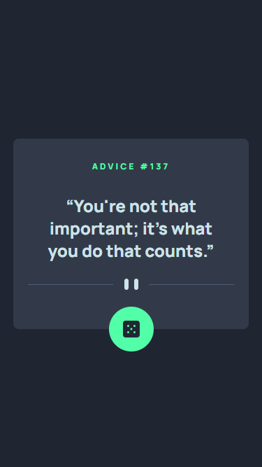
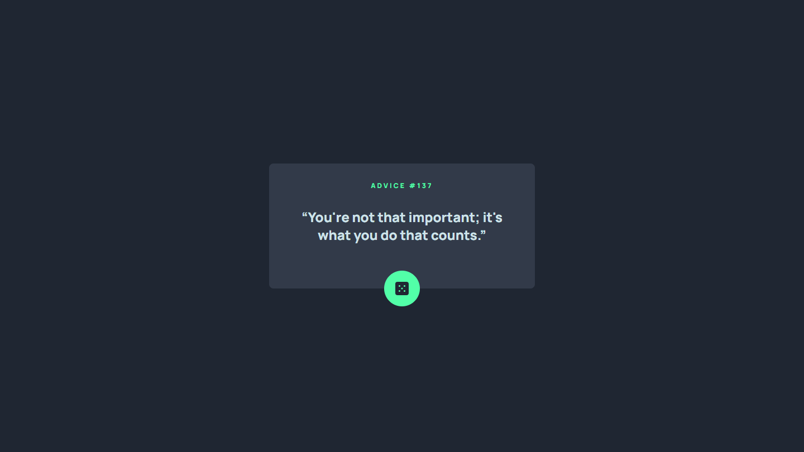

# Frontend Mentor - Advice generator app solution

This is a solution to the [Advice generator app challenge on Frontend Mentor](https://www.frontendmentor.io/challenges/advice-generator-app-QdUG-13db). Frontend Mentor challenges help you improve your coding skills by building realistic projects.

## Table of contents

- [Overview](#overview)
  - [The challenge](#the-challenge)
  - [Screenshots](#screenshots)
  - [Links](#links)
- [My process](#my-process)
  - [Built with](#built-with)
  - [What I learned](#what-i-learned)
  - [Continued development](#continued-development)
  - [Useful resources](#useful-resources)
- [Author](#author)

## Overview

### The challenge

Users should be able to:

- View the optimal layout for the app depending on their device's screen size
- See hover states for all interactive elements on the page
- Generate a new piece of advice by clicking the dice icon

### Screenshots

> Mobile Preview
> 

> Desktop Preview
> 

### Links

- Solution URL: [https://github.com/Willwf/advice-generator-app](https://github.com/Willwf/advice-generator-app)
- Live Site URL: [https://advice-generator-app-rust-xi.vercel.app/](https://advice-generator-app-rust-xi.vercel.app/)

## My process

### Built with

- Semantic HTML5 markup
- Mobile-first workflow
- [React](https://reactjs.org/) - JS library
- [Tailwind](https://tailwindcss.com/) - A utility-first CSS framework
- [Advice Slip API](https://api.adviceslip.com/) - The Advice Slip JSON API

### What I learned

I've made this little project to experiment and use Tailwind. It was very entertaining and interesting to search and do all the styling on the HTML. It was my very first time doing something similar and I intend to make a bigger project to intensify the challenge. It is a very smart and powerful way of styling, I just think that I need to organize better the order of the classnames to make it easier for maintenance.

### Continued development

I'm gonna try using Tailwind again on a bigger project to see how it will scale.

### Useful resources

- [Tailwind Documentation](https://tailwindcss.com/docs/installation) - The official documentation helped me set up and had everything that I needed to learn how to use it.

## Author

- Github - [William Firmino](https://github.com/Willwf)
- Frontend Mentor - [@Willwf](https://www.frontendmentor.io/profile/Willwf)
- Twitter - [@Williamwf](https://www.twitter.com/Williamwf)
- LinkedIn - [William Firmino](https://www.linkedin.com/in/williamfirmino/)
